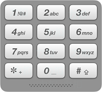

# 17. 电话号码的字母组合（中等）
https://leetcode-cn.com/problems/letter-combinations-of-a-phone-number/

给定一个仅包含数字 2-9 的字符串，返回所有它能表示的字母组合。\
给出数字到字母的映射如下（与电话按键相同）。注意 1 不对应任何字母。


## 示例
```
输入："23"
输出：["ad", "ae", "af", "bd", "be", "bf", "cd", "ce", "cf"].
```



## 说明
尽管上面的答案是按字典序排列的，但是你可以任意选择答案输出的顺序。

来源：力扣（LeetCode）
链接：https://leetcode-cn.com/problems/letter-combinations-of-a-phone-number
著作权归领扣网络所有。商业转载请联系官方授权，非商业转载请注明出处。

## 解答
### 解法1：递归
```java
class Solution {
    public List<String> res = new ArrayList<>();
    public String[] dict = {"", "", "abc", "def", "ghi", "jkl", "mno", "pqrs", "tuv", "wxyz"};

    public List<String> letterCombinations(String digits) {
        if (digits.length() == 0) return res;
        recur(digits, 0, "");
        return res;
    }

    public void recur(String digits, int index, String str) {
        if (index == digits.length()) {
            res.add(str);
            return;
        }
        int thisI = Integer.parseInt("" + digits.charAt(index));
        String letters = dict[thisI];
        for (int i = 0; i < letters.length(); i++) {
            recur(digits, index + 1, str + letters.charAt(i));
        }
    }
}
```

### 解法2：BFS
```java
class Solution {
    public List<String> res = new ArrayList<>();
    public String[] dict = {"", "", "abc", "def", "ghi", "jkl", "mno", "pqrs", "tuv", "wxyz"};
    LinkedList<String> queue = new LinkedList<>();

    public List<String> letterCombinations(String digits) {
        if (digits.length() == 0) return res;
        queue.offer("");
        char[] chars = digits.toCharArray();
        for (int i = 0; i < chars.length; i++) {
            int size = queue.size();
            for (int j = 0; j < size; j++) {
                String thisStr = queue.poll();
                String letterStr = dict[chars[i] - '0'];
                for (int k = 0; k < letterStr.length(); k++) {
                    queue.offer(thisStr + letterStr.charAt(k));
                }
            }
        }
        return queue;
    }
}
```